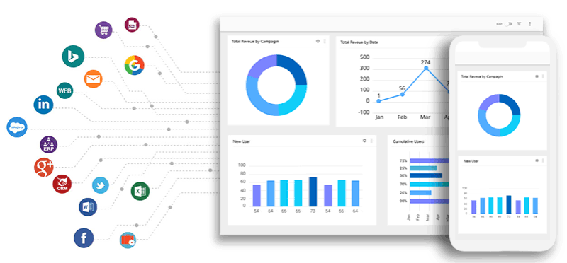

### Hi there 👋, my name is Ishant and I'm on a thrilling journey to dive into the world of data analytics

> Excel|[SQL](https://github.com/ishantinsights/ishantinsights.github.io/blob/7a75ee8b6ecb6d524e37ae59cce0b982fb2eebbf/sql%20advanced%20hackerrank.JPG)| [Tableau](https://github.com/ishantinsights/ishantinsights.github.io/blob/623c52a9523aff46be6e97a414340cd6bd6115f6/Tableau%20Desktop%20Specialist%20certificate.pdf) | PowerBI | Python

*click on the project title to view the code*
##  [Project 1: Customer Segmentation of Cloud Kitchen - RFM Model](https://github.com/ishantinsights/Customer-Segmentation/blob/4fa2f776e4e2eb6b626c8c0e0dc6492385393c9b/Customer_Segmentation.ipynb)

> A cloud kitchen aims to optimize its marketing efforts and improve customer retention. By segmenting its customers using the Recency, Frequency, Monetary (RFM) model, the kitchen can target marketing strategies more effectively and personalize customer engagement

- Step 1 involved calculating the monetary value : Understanding the total monetary value of each customer
- Step 2 calculating the frequency : Understanding how often each customer makes an purchase
- Step 3 calculating the recency : Measure the time since each customer's last purchase
- Step 4 Merging RFM Metrics
- Step 5 : Categorizing Customers
- Step 6 : Recommendations

### Outcome
- Out of 4300 unique customers 26% are potential loyalists and 18% champions
- 8% of the customers are at risk

##  [Project 2: Hypothesis Testing on Factors Affecting the Demand of Electric Bikes](https://github.com/ishantinsights/hypothesis-testing/blob/302ae9e230b98d4b18ecc1c16eab8751529181c8/Electric_Bike_Hypothesis_testing.ipynb)

> Problem Statement: Company has recently suffered considerable dips in its revenues. They have contracted a consulting company to understand the factors on which the demand for these shared electric cycles depends. Specifically, they want to understand the factors affecting the demand for these shared electric cycles in the Indian market

- **Step 1: Understanding the Data**: The journey began with exploring and preparing the dataset, which included variables such as datetime, season, weather, temperature, humidity, and bike counts. Basic data checks(missing values handling/duplicate rows/outlier handling/converting numerical columns to categorical columns) were performed to ensure data integrity and completeness.

- **Step 2: Exploratory Data Analysis (EDA)**: Univariate and bivariate analyses were conducted to understand the distribution and relationships between various factors and bike rental counts.

- **Step 3: Hypothesis Testing**: To delve deeper into the factors influencing demand, hypothesis testing was conducted. Tests examined the effects of variables like day category (weekday/weekend), weather conditions, and seasons on bike rental counts

- **Step 4: Insights and Recommendations**: Insights gained from the analysis provided valuable recommendations for the company. For instance, focusing marketing efforts on weekdays and during clear weather could optimize rental revenues
  
### Outcome: 
- **Weather Significantly Affects Demand** : Clear weather seems to be the most favorable condition for renting electric bikes, while light rain has the least favorable conditions
- **Seasonal Impact on Rental Demand** : Fall exhibits the highest demand for rental bikes, while spring shows the lowest demand
- **Day of the Week Influences Demand** : Weekdays witness higher demand for rental bikes compared to weekends, suggesting a potential weekday commuter market
- **Hourly Demand Patterns** : Hourly trend show that counts vary significantly during the day, peaking in the afternoon, gradually declining in the evening and at night, and being at their lowest in the early morning, morning, and evening hours

## [Project 3: Ecommerce KPI Dashboard Using Tableau](https://public.tableau.com/app/profile/ishant.kamra/viz/SuperStoreDashboard_17016337291000/Dashboard1)

## Project 4 : KPI Dashboard Using Excel

##  [Project 5: OTT Platform Content Strategy Analysis(EDA)](https://github.com/ishantinsights/projects/blob/c8e847e4d7b2ea10dc0df067bdebc6aad00caf36/OTT_Case_Study.ipynb)

> Problem Statement: Analyze the data and generate insights that could help the OTT platform in deciding which type of shows/movies to produce and how they can grow the business in different countries

- **Step 1: Basic Data Checks**: The journey began with exploring and preparing the dataset, which included variables such as subscription duration, content type, viewing time, customer demographics.Basic data checks (handling missing values, duplicate rows, outlier detection, and converting numerical columns to categorical columns) were performed to ensure data integrity and completeness
  
- **Step 2: Preprocessing/Data Cleaning and Basic analysis**: Cleaned the data and unnest the columns - cast,country,listed in and director and replaced the null values in categorical columns with unknowns

- **Step 3: EDA** : Univariate and bivariate analyses were conducted to understand the distribution of various factors. This helped identify key trends such as duration of content , preferred content types and preferred country for producing movies/tv shows

- ** Step 5: Insights and Recommendations** : Insights gained from the analysis provided valuable recommendations for the company. For instance, focusing on movie duration within the range 90 to 120 mins and release TV shows atmost 2 seasons

  

